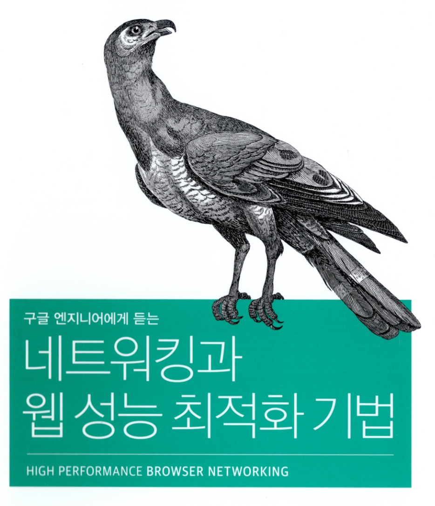

# High Performance Browser Networking 요약

  

Ilya Grigorik의 *High Performance Browser Networking*을 장별로 정리한 한국어 요약입니다.

## 노션용 정리본

- [노션 한 페이지 정리본](notion-one-page.md)

## 목차

### Part 1. Networking Primer

- [01. 레이턴시와 대역폭](part-1-networking-primer/01-latency-and-bandwidth.md)
- [02. TCP의 구성요소](part-1-networking-primer/02-tcp.md)
- [03. UDP의 구성요소](part-1-networking-primer/03-udp.md)
- [04. 전송 계층 보안 TLS](part-1-networking-primer/04-tls.md)

### Part 2. Wireless Networks

- [01. 무선 네트워크 소개](part-2-wireless-networks/01-wireless-networks.md)
- [02. WiFi](part-2-wireless-networks/02-wifi.md)
- [03. 모바일 네트워크](part-2-wireless-networks/03-mobile-networks.md)
- [04. 모바일 네트워크 최적화](part-2-wireless-networks/04-mobile-network-optimization.md)

### Part 3. HTTP

- [01. HTTP의 역사](part-3-http/01-history-of-http.md)
- [02. 웹 성능 이해의 첫걸음](part-3-http/02-primer-on-web-performance.md)
- [03. HTTP 1.x](part-3-http/03-http-1x.md)
- [04. HTTP 2.0](part-3-http/04-http-20.md)
- [05. 애플리케이션 전송 최적화](part-3-http/05-application-delivery-optimization.md)

### Part 4. Browser APIs

- [01. 브라우저 네트워킹의 첫걸음](part-4-browser-apis/01-browser-networking.md)
- [02. XMLHttpRequest](part-4-browser-apis/02-xmlhttprequest.md)
- [03. Server-Sent Events](part-4-browser-apis/03-server-sent-events.md)
- [04. WebSocket](part-4-browser-apis/04-websocket.md)
- [05. WebRTC](part-4-browser-apis/05-webrtc.md)
